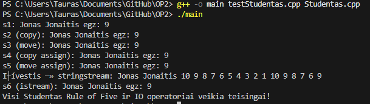

# OP
Objektinis Programavimas

## Naudojimosi instrukcija

1. Atsisiųskite (arba nuklonuokite) šį projektą į savo kompiuterį.
2. Atidarykite terminalą tame aplanke.
Pvz. C:\Users\Public\Documents\GitHub\OP2
3. Programos paleidimas (įveskite į terminalą): 
mkdir build
cd build
cmake ..
cmake --build .
cd Debug
main.exe
4. Vykdykite programos nurodymus terminale:
   - Pasirinkite veiksmą (failų generavimas, duomenų įvedimas, skaitymas iš failo ir t.t.).
   - Pasirinkite rūšiavimo būdą.
   - Įveskite failo pavadinimą, jei reikia.
5. Rezultatai bus išsaugoti į `vargsai.txt` ir `kietakai.txt` failus.

Sistema: Intel i9-14900HX, 32GB RAM, SSD 1000GB, Windows 11

## Studentas klasės perdengti metodai

| Metodas                  | Paskirtis                                                                 |
|--------------------------|---------------------------------------------------------------------------|
| Studentas()              | Numatytasis konstruktorius                                                |
| Studentas(args...)       | Pilnas konstruktorius                                                     |
| ~Studentas()             | Destruktorius                                                             |
| Studentas(const&)        | Kopijavimo konstruktorius                                                 |
| Studentas(Studentas&&)   | Perkėlimo (move) konstruktorius                                           |
| operator=(const&)        | Kopijavimo priskyrimo operatorius                                         |
| operator=(Studentas&&)   | Perkėlimo (move) priskyrimo operatorius                                   |
| operator>>(istream&, Studentas&) | Duomenų įvedimas iš srauto (failo, ekrano, stringstream ir pan.)   |
| operator<<(ostream&, const Studentas&) | Duomenų išvedimas į srautą (failą, ekraną, stringstream ir pan.) |

### Duomenų įvedimas

- **Rankiniu būdu:** per programos meniu galima įvesti studentų duomenis klaviatūra.
- **Automatiškai:** galima generuoti atsitiktinius studentų duomenis.
- **Iš failo:** galima nuskaityti studentų duomenis iš failo (pvz., studentai10000.txt).

### Duomenų išvedimas

- **Į ekraną:** studentų rezultatai gali būti atvaizduojami terminale.
- **Į failą:** rezultatai gali būti išsaugomi į failus (pvz., vargsai.txt, kietakai.txt).

### Testavimas

Visi metodai patikrinti su testStudentas.cpp:
- Tikrinami visi konstruktoriai, priskyrimo operatoriai, įvesties/išvesties operatoriai.
- Testo išvestis (pavyzdys):

```
s1: Jonas Jonaitis egz: 9
s2 (copy): Jonas Jonaitis egz: 9
s3 (move): Jonas Jonaitis egz: 9
s4 (copy assign): Jonas Jonaitis egz: 9
s5 (move assign): Jonas Jonaitis egz: 9
Išvestis į stringstream: Jonas Jonaitis 10 9 8 7 6 5 4 3 2 1 10 9 8 7 6 9                
s6 (istream): Jonas Jonaitis egz: 9
Visi Studentas Rule of Five ir IO operatoriai veikia teisingai!
```

**Papildomai:** 

